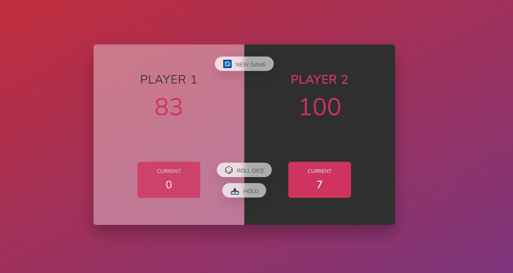

# JavaScript Dice game

This game allows each player to throw a virtual dice as many times they want. Each dice throw is added to a current score. At any point the player can press the hold button to add the current score to their full score and give the other player a turn. If a player gets a 1 from the dice the player will loose the current score and it will be the next players turn. 

## Technologies 
- JavaScript
- CCS
- HMTL 

